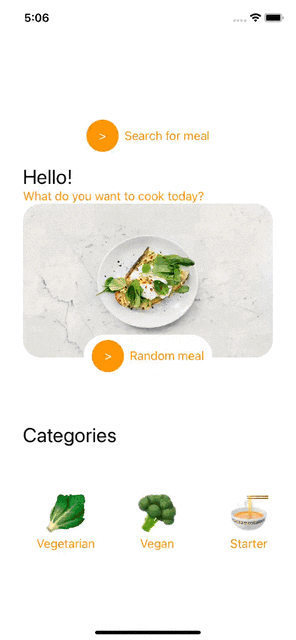
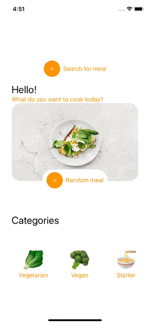

# Tasty Recipes
This is an app where you can browse for new recipes by category. Apart from that you can browse for your desired meal by name. If application wont't find
your desired meal, you will get informed.
 
 
 

### Used Technologies:
1. SwiftUI
2. Unit Tests
3. SFSymbols
4. TheMealDB API
 

### Images and API
1. Image - [a link](https://images.pexels.com/photos/1095550/pexels-photo-1095550.jpeg?auto=compress&cs=tinysrgb&w=1260&h=750&dpr=2)
2. Used API - [a link](https://www.themealdb.com)
 

### Screenshots

